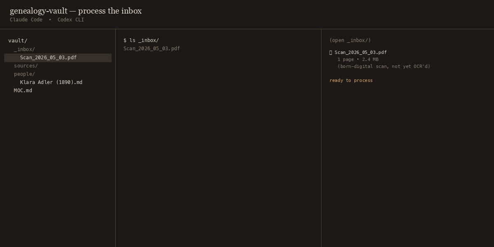
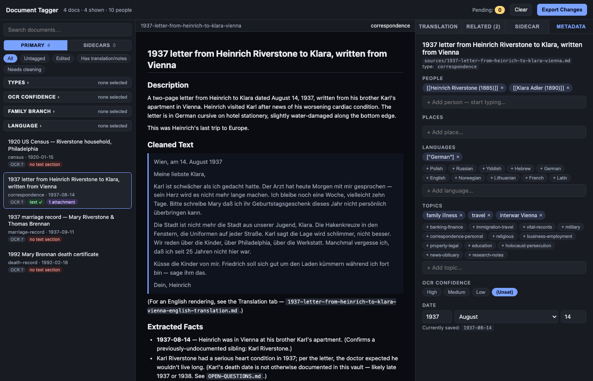
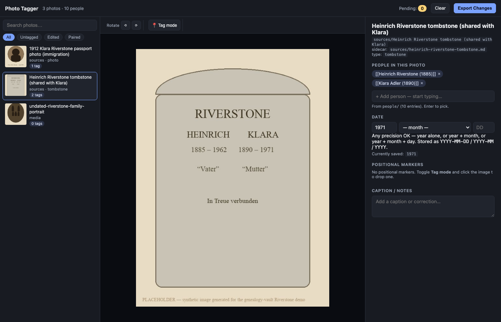

# genealogy-vault

[](https://github.com/elkusbry/genealogy-vault/actions/workflows/ci.yml)
[](LICENSE)
[](https://github.com/elkusbry/genealogy-vault/releases)
[](https://www.anthropic.com/claude-code)
[](https://github.com/openai/codex)

**An AI-assisted Obsidian genealogy vault. Drop scans, get a family tree.**



<!-- 10-frame animated hero (23 s loop): frames 1-8 are schematic
     agent-log frames showing the workflow steps (PIL-rendered); frames
     9-10 are REAL headless-Chrome screenshots of the actual taggers in
     demo/_tools/, with a document and a photo selected. The static
     composite is preserved at docs/screenshots/hero.png. -->

The taggers up close (real screenshots from `demo/_tools/`):

<table><tr>
<td><a href="docs/screenshots/document-tagger.png"></a></td>
<td><a href="docs/screenshots/photo-tagger.png"></a></td>
</tr></table>


> Works with **Claude Code** and **Codex CLI** out of the box. One canonical
> skill, two per-agent wrappers. Your private vault stays private.

---

## What this is

An [Obsidian](https://obsidian.md/) vault preconfigured to be an
intelligent genealogy assistant. It ships with:

- **A canonical skill** at `skill/SKILL.md` that teaches an AI coding agent
  (Claude Code or Codex CLI) how to manage your family-history knowledge
  base — schemas, workflows, conventions.
- **A scan pipeline** (`_scripts/scan-pipeline/`) that OCRs PDFs you drop
  in `_inbox/`, extracts entities, and files them into `sources/`.
- **Two curation UIs** (`_tools/document-tagger.html`, `photo-tagger.html`)
  — single-file HTML viewers for batch-tagging sidecars and photos.
- **Schemas + templates** for `person`, `document`, and `media` files —
  the public API of the vault.
- **An idempotent installer** that doubles as the updater for power users.
- **A fictional demo family** (the **Riverstones** in `demo/`) covering
  every demoable workflow, so you can clone and immediately see something
  working.

## The three on-ramps

### 1. Genealogy hobbyist — "show me the vault working" (5 min)

```sh
git clone https://github.com/<your-username>/genealogy-vault.git
cd genealogy-vault
open -a Obsidian .       # macOS; on Linux/Windows, open the dir as an Obsidian vault
```

Then [open `demo/MOC.md`](demo/MOC.md) to see the Riverstone family tree
and click around. Every wikilink, every source citation, every research
question is real (just fictional).

When you're ready to add your own family, see
[`docs/quickstart-hobbyist.md`](docs/quickstart-hobbyist.md).

### 2. Obsidian + AI power user — "install into my existing vault" (30 min)

```sh
git clone https://github.com/elkusbry/genealogy-vault.git
cd genealogy-vault
./install.sh /path/to/your/existing/vault
```

The installer copies just the tooling (skill, scripts, templates,
entry-point files) into your vault. Your `people/`, `sources/`, `media/`
are untouched. Re-run the installer any time to upgrade.

**Alternative — install the skill as a Claude Code plugin** (still need
to run `install.sh` for the scripts and templates):

```
/plugin marketplace add elkusbry/genealogy-vault
/plugin install genealogy-vault@genealogy-vault
```

The plugin path gives you `/plugin upgrade` for the skill content;
re-run `install.sh` for the rest.

Full guide: [`docs/setup-powerusers.md`](docs/setup-powerusers.md).

### 3. Developer — "I want to fork the pattern" (study time)

The architecture is documented at [`ARCHITECTURE.md`](ARCHITECTURE.md).
Key patterns:

- **One canonical skill, multiple agent wrappers.** `skill/SKILL.md` is
  agent-agnostic; `.claude/skills/genealogy/SKILL.md` (Claude Code) and
  `AGENTS.md` (Codex) are thin pointers.
- **Schemas are the public API.** Breaking changes require migration
  scripts (see `_scripts/migrations/README.md`).
- **Tooling vs. data separation.** Tooling under `skill/`, `_scripts/`,
  `_tools/`, `templates/`; data under `people/`, `sources/`, `media/`,
  `_inbox/`. Upgrades touch only tooling.

This same pattern works for any opinionated Obsidian + AI workflow — not
just genealogy.

## How it works

```
You: "process the inbox"

Agent (Claude Code or Codex):
  1. Reads skill/SKILL.md and skill/workflows/process-inbox.md
  2. For each PDF in _inbox/:
     - Runs _scripts/scan-pipeline/process-scans.sh (OCR)
     - Reads the OCR text, identifies the document type
     - Extracts entities (people, places, dates, vital events)
     - Writes a structured sidecar to _inbox/<descriptive>.md
  3. Runs _scripts/scan-pipeline/move_inbox_to_sources.py
     - Files PDF + sidecar into sources/, renaming PDF to match
  4. For each new source:
     - Creates new person files in people/ for newly-discovered people
     - Updates existing person files with new facts + citations
     - Adds [research/has-questions] todos for uncertain readings
  5. Updates MOC.md
```

This works the same in Claude Code (via the skill at
`.claude/skills/genealogy/`) and in Codex CLI (via `AGENTS.md`). The
underlying skill content lives in one place.

## What's in the box

- **Schemas:** [`person`](skill/schemas/person.schema.md),
  [`document`](skill/schemas/document.schema.md),
  [`media`](skill/schemas/media.schema.md)
- **Workflows:** [process inbox](skill/workflows/process-inbox.md),
  [add person](skill/workflows/add-person.md),
  [process source](skill/workflows/process-source.md),
  [translate](skill/workflows/translate-document.md),
  [tag photos](skill/workflows/tag-photos.md),
  [research & maintenance](skill/workflows/research-and-maintenance.md)
- **Scripts:** scan pipeline (`_scripts/scan-pipeline/`), tagger
  builders (`_scripts/taggers/`), migration runner (`_scripts/migrate.py`)
- **Demo:** the Riverstone family (`demo/`)
- **Docs:** [hobbyist quickstart](docs/quickstart-hobbyist.md),
  [power-user setup](docs/setup-powerusers.md),
  [using with Claude Code](docs/using-with-claude-code.md),
  [using with Codex](docs/using-with-codex.md),
  [workflows](docs/workflows.md), [upgrading](docs/upgrading.md),
  [contributing](docs/contributing.md),
  [maintainer workflow](docs/maintainer-workflow.md)

## Optional integrations

- **[Charted Roots](https://github.com/skiqh/charted-roots)** — Obsidian
  plugin for rendering the family tree as an interactive graph. The
  `person` schema includes optional Charted Roots fields (`cr_id`,
  `born`/`died` flat duplicates of nested fields, parallel `*_id`
  relationship arrays). Leave them blank if you don't use the plugin.

## Roadmap

- **v0.2 — shipped.** Claude Code plugin scaffolding
  (`.claude-plugin/plugin.json` + `marketplace.json` +
  `skills/genealogy/SKILL.md`); CC0 placeholder JPEGs for demo;
  prebuilt tagger HTMLs against the Riverstone fixture.
- **v0.3 — shipped.** Static hero composite at the top of this README;
  skill validator (`_scripts/validate_skill.py`) + CI step that catches
  broken references and stale workflow links; tagger-build smoke test
  in CI against the Riverstone fixture.
- **v0.4 — shipped.** Animated 8-frame hero GIF showing the workflow
  end-to-end; maintainer workflow doc explaining how changes flow
  between a personal vault and this public toolkit; drift-check script
  (`_scripts/drift_check.sh`) that surfaces local-vault divergences
  before re-running `install.sh`.
- **v0.5** — Real screen capture of the workflow in a real Claude Code
  session (the v0.4 hero is synthetic); hosted demo site (Quartz /
  obsidian-html static export of the Riverstones — Jekyll alone can't
  render Obsidian wikilinks); CI that exercises both Claude Code and
  Codex end-to-end against the demo (requires interactive harness).

## Contributing

See [`docs/contributing.md`](docs/contributing.md). The rule: test
changes against BOTH Claude Code and Codex CLI before opening a PR.

## License

[MIT](LICENSE).
